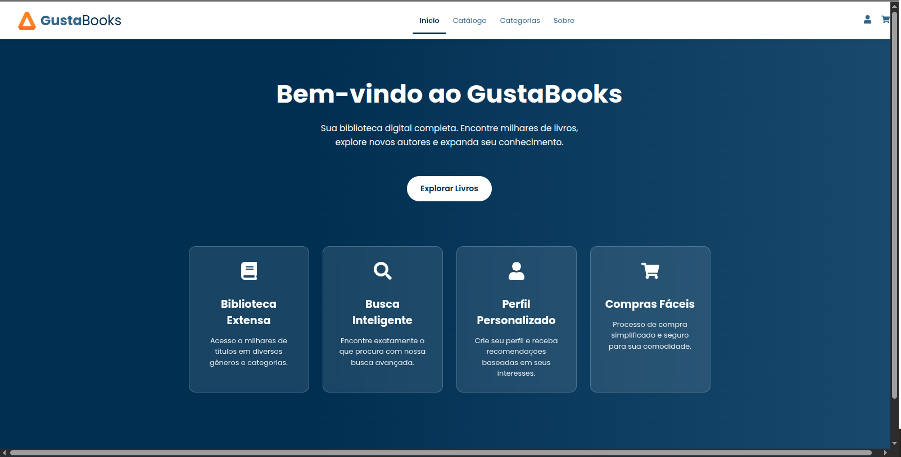
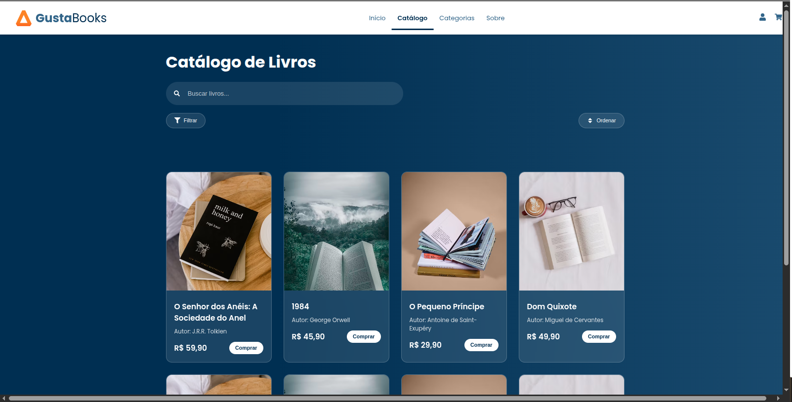
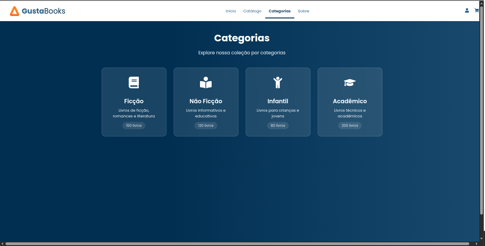
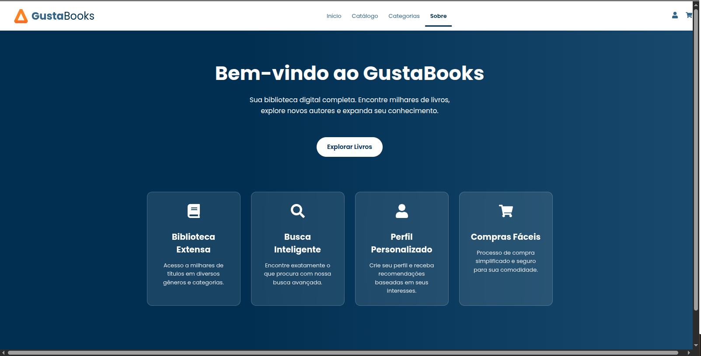

# GustaBooks 📚

GustaBooks é uma plataforma moderna de livros digitais desenvolvida com React, oferecendo uma experiência de usuário intuitiva e elegante para explorar, comprar e gerenciar sua biblioteca digital.

## 🚀 Funcionalidades

- **Catálogo Dinâmico**: Explore milhares de livros organizados por categorias
- **Sistema de Categorias**: Navegação intuitiva por gêneros literários
- **Interface Responsiva**: Design adaptável para todos os dispositivos
- **Animações Suaves**: Experiência visual agradável com transições e efeitos
- **Tema Personalizado**: Design moderno com esquema de cores profissional

## 🖼️ Screenshots

### Página Inicial

*A página inicial apresenta um banner destacado e cards de livros em evidência*

### Catálogo

*O catálogo oferece uma visualização completa dos livros disponíveis com filtros*

### Categorias

*Navegação intuitiva por categorias com cards interativos*

### Sobre

*Página de informações sobre o projeto*

## 🛠️ Tecnologias Utilizadas

- React.js
- Styled Components
- Framer Motion
- React Router
- React Icons

## 🎨 Design

O projeto utiliza um design moderno e minimalista com:
- Gradiente de cores profissional
- Cards com efeito de vidro (glassmorphism)
- Animações suaves
- Tipografia clara e legível
- Layout responsivo

## 📱 Páginas

- **Home**: Página inicial com destaque para livros em evidência
- **Catálogo**: Lista completa de livros com filtros
- **Categorias**: Navegação por gêneros literários
- **Sobre**: Informações sobre o projeto

## 🚀 Como Executar

1. Clone o repositório
```bash
git clone git@github.com:gustavobbrz/GustaBooks.git
```

2. Instale as dependências
```bash
cd GustaBooks
npm install
```

3. Execute o projeto
```bash
npm start
```

## 📝 Licença

Este projeto está sob a licença MIT. Veja o arquivo [LICENSE](LICENSE) para mais detalhes.

## 👤 Autor

Gustavo B Brizolla
- GitHub: [@gustavobbrz](https://github.com/gustavobbrz)

# Getting Started with Create React App

This project was bootstrapped with [Create React App](https://github.com/facebook/create-react-app).

## Available Scripts

In the project directory, you can run:

### `npm start`

Runs the app in the development mode.\
Open [http://localhost:3000](http://localhost:3000) to view it in your browser.

The page will reload when you make changes.\
You may also see any lint errors in the console.

### `npm test`

Launches the test runner in the interactive watch mode.\
See the section about [running tests](https://facebook.github.io/create-react-app/docs/running-tests) for more information.

### `npm run build`

Builds the app for production to the `build` folder.\
It correctly bundles React in production mode and optimizes the build for the best performance.

The build is minified and the filenames include the hashes.\
Your app is ready to be deployed!

See the section about [deployment](https://facebook.github.io/create-react-app/docs/deployment) for more information.

### `npm run eject`

**Note: this is a one-way operation. Once you `eject`, you can't go back!**

If you aren't satisfied with the build tool and configuration choices, you can `eject` at any time. This command will remove the single build dependency from your project.

Instead, it will copy all the configuration files and the transitive dependencies (webpack, Babel, ESLint, etc) right into your project so you have full control over them. All of the commands except `eject` will still work, but they will point to the copied scripts so you can tweak them. At this point you're on your own.

You don't have to ever use `eject`. The curated feature set is suitable for small and middle deployments, and you shouldn't feel obligated to use this feature. However we understand that this tool wouldn't be useful if you couldn't customize it when you are ready for it.

## Learn More

You can learn more in the [Create React App documentation](https://facebook.github.io/create-react-app/docs/getting-started).

To learn React, check out the [React documentation](https://reactjs.org/).

### Code Splitting

This section has moved here: [https://facebook.github.io/create-react-app/docs/code-splitting](https://facebook.github.io/create-react-app/docs/code-splitting)

### Analyzing the Bundle Size

This section has moved here: [https://facebook.github.io/create-react-app/docs/analyzing-the-bundle-size](https://facebook.github.io/create-react-app/docs/analyzing-the-bundle-size)

### Making a Progressive Web App

This section has moved here: [https://facebook.github.io/create-react-app/docs/making-a-progressive-web-app](https://facebook.github.io/create-react-app/docs/making-a-progressive-web-app)

### Advanced Configuration

This section has moved here: [https://facebook.github.io/create-react-app/docs/advanced-configuration](https://facebook.github.io/create-react-app/docs/advanced-configuration)

### Deployment

This section has moved here: [https://facebook.github.io/create-react-app/docs/deployment](https://facebook.github.io/create-react-app/docs/deployment)

### `npm run build` fails to minify

This section has moved here: [https://facebook.github.io/create-react-app/docs/troubleshooting#npm-run-build-fails-to-minify](https://facebook.github.io/create-react-app/docs/troubleshooting#npm-run-build-fails-to-minify)
